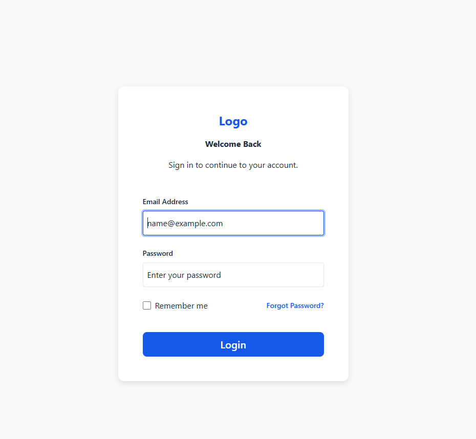

# Stage 01 — Modern HTML & CSS

## Overview

This stage focuses on mastering the HTML and CSS fundamentals used in modern frontend development.

Rather than learning every HTML element or CSS property, the emphasis is on the **20% of concepts that provide 80% of real-world value** through practical projects.

Throughout this stage, I built multiple responsive pages while applying semantic HTML, reusable CSS architecture, Flexbox layouts, accessibility principles, and modern frontend best practices.

---

# Project Description

This stage contains four small frontend projects that gradually increase in complexity.

Projects included:

- Login Page
- Registration Page
- Profile Edit Page
- Admin Dashboard

Each project was built from scratch using only HTML5 and CSS3 without frameworks.

---

# Technologies Used

- HTML5
- CSS3
- Flexbox
- CSS Variables
- Responsive Design
- Semantic HTML
- Native Form Validation

---

# Folder Structure

# Folder Structure

```text
frontend-roadmap/
│
├── assets/
│   ├── css/
│   │   ├── global.css
│   │   ├── reset.css
│   │   └── variables.css
│   │
│   ├── icons/
│   │
│   ├── images/
│   │   └── avatar.png
│   │
│   └── screenshots/
│       └── stage-01/
│           ├── admin-dashboard.png
│           ├── login-page.png
│           ├── profile-edit.png
│           └── registration-page.png
│
└── stage-01-html-css/
    ├── admin-dashboard/
    │   ├── index.html
    │   └── style.css
    │
    ├── login-page/
    │   ├── index.html
    │   └── style.css
    │
    ├── profile-edit/
    │   ├── index.html
    │   └── style.css
    │
    ├── registration-page/
    │   ├── index.html
    │   └── style.css
    │
    └── README.md
```

---

# Completed Features

## Login Page

- Responsive authentication page
- Email & Password fields
- Remember Me checkbox
- Forgot Password link
- Native HTML validation

---

## Registration Page

- User registration form
- Two-column responsive layout
- Password confirmation
- Birth date picker
- Gender selection
- Terms & Conditions

---

## Profile Edit

- Profile image upload
- Full profile information
- Bio textarea
- Save Changes button

---

## Admin Dashboard

Includes:

- Responsive Header
- Sidebar Navigation
- Statistics Cards
- Recent Users Table
- Status Badges
- Responsive Table
- Footer

---

# Skills Learned

After completing this stage, I can confidently:

- Write semantic HTML
- Build accessible forms
- Use native HTML validation
- Build responsive layouts with Flexbox
- Create reusable CSS using variables
- Organize CSS into reusable modules
- Build reusable UI components
- Create responsive dashboards
- Build responsive data tables
- Apply consistent spacing and typography
- Improve accessibility
- Refactor HTML and CSS for maintainability

---

# Screenshots

## Login Page



---

## Registration Page


---

## Profile Edit


---

## Admin Dashboard

Includes:

- Dashboard Layout
- Statistics Cards
- Recent Users Table


---

# Future Improvements

If this project were continued beyond the learning stage, I would improve it by:

- Adding JavaScript interactivity
- Implementing Dark Mode
- Adding animations and transitions
- Creating reusable CSS components
- Improving mobile navigation
- Replacing emojis with SVG icons
- Connecting the pages to a backend API
- Migrating the project to React
- Improving accessibility to WCAG standards

---

# Status

**Stage 01 Complete ✅**

All planned sprints have been completed, including:

- Design System
- Login Page
- Registration Page
- Profile Edit
- Dashboard Layout
- Statistics Cards
- Recent Users Table
- Polish & Refactoring
- Documentation

---

# Author

**Khaled Alawi**

Software Engineering Student

Learning Path:

**Frontend → Java → Spring Boot → React → Full-Stack Development**


# Stage 3 — Modern JavaScript

### Status

**Completed**

Stage 3 focused on refreshing modern JavaScript through a realistic movie-search application.

The goal was to move from JavaScript syntax and isolated exercises to building a structured frontend application using modern JavaScript and connecting it to a real backend.

### Project

**MovieFinder**

A movie search application built with:

* HTML5
* CSS3
* Modern JavaScript (ES6+)
* JavaScript Modules
* DOM API
* Array Methods
* Async JavaScript
* Fetch API
* REST API
* Spring Boot

### What I Practiced

#### Modern JavaScript

* `const` / `let`
* Arrow functions
* Template literals
* Destructuring
* Spread operator
* ES modules
* Objects and arrays
* Array methods
* `filter()`
* `map()`
* `sort()`
* `reduce()`
* `find()`
* `some()`
* `every()`

#### DOM and Events

* DOM selection
* DOM manipulation
* Event listeners
* Form events
* Input events
* Click events
* Event delegation
* Dynamic rendering

#### Async JavaScript

* Promises
* `async`
* `await`
* `fetch()`
* HTTP requests
* JSON
* Error handling
* Loading states

### Application Features

The MovieFinder application supports:

* Search movies
* Filter by title
* Filter by genre
* Sort by rating
* Sort by year
* Sort alphabetically
* Movie statistics
* Average rating
* Highest rating
* Add movies to favorites
* Remove movies from favorites
* Application state
* Loading state
* Error state
* Empty search results
* Responsive movie grid

### Frontend Architecture

The JavaScript application was organized into separate responsibilities:

```text
js/
│
├── main.js
│
├── api/
│   └── movieApi.js
│
├── components/
│   ├── movieCard.js
│   └── movieList.js
│
├── services/
│   └── movieService.js
│
├── state/
│   └── appState.js
│
└── utils/
```

The main responsibilities are separated between:

```text
main.js
    ↓
Application orchestration

api/
    ↓
Backend communication

services/
    ↓
Movie filtering, sorting, statistics, favorites

components/
    ↓
UI rendering

state/
    ↓
Application state
```

### Backend Integration

For the first time, the frontend was connected to a Spring Boot REST API.

The architecture became:

```text
Browser
   │
   │ HTTP
   ▼
Vanilla JavaScript
   │
   │ fetch()
   ▼
Spring Boot REST API
   │
   ▼
Database
```

The Spring Boot backend is included inside the same Stage 3 folder:

```text
stage-03-modern-javascript/
│
├── index.html
├── css/
├── js/
│
└── movie-api/
    │
    ├── Dockerfile
    ├── pom.xml
    │
    └── src/
        └── main/
            ├── java/
            └── resources/
```

The backend provides the movie REST API used by the JavaScript application.

### Docker

The Spring Boot backend also includes a `Dockerfile`.

This makes running the backend easier without requiring the Java application to be started manually every time.

The backend can be built and run using Docker:

```bash
cd movie-api

docker build -t movie-api .

docker run -p 8080:8080 movie-api
```

The Spring Boot API is then available at:

```text
http://localhost:8080
```

The frontend communicates with the backend through endpoints such as:

```text
GET /api/movies?search=inter
```

### Final Architecture

```text
                 MovieFinder
                     │
                     ▼
              Vanilla JavaScript
                     │
             ┌───────┴────────┐
             │                │
          DOM/UI          App State
             │                │
             └───────┬────────┘
                     │
                  fetch()
                     │
                     ▼
              Spring Boot API
                     │
                     ▼
                  Database
```

### Key Learning Outcome

The most important outcome of this stage was moving from:

```text
Learning JavaScript
       ↓
Writing JavaScript exercises
```

to:

```text
Building a real frontend
       ↓
Organizing JavaScript modules
       ↓
Managing application state
       ↓
Handling asynchronous operations
       ↓
Calling a REST API
       ↓
Connecting frontend + backend
```

This stage provides the foundation needed to move from **Vanilla JavaScript to React**.

### Stage 3 Project

[View Stage 3 — Modern JavaScript](stage-03-modern-javascript/)

[View Stage 3 README](stage-03-modern-javascript/README.md)

# Stage 4 — TypeScript

This stage focuses on learning and applying TypeScript through practical frontend development.

Instead of studying TypeScript only through isolated examples, the concepts are introduced while building a real Task Manager application.

---

## 🎯 Goal

The goal of this stage is to understand how TypeScript improves JavaScript applications through:

- Static typing
- Type inference
- Interfaces
- Type aliases
- Union types
- Utility types
- Generics
- Type guards
- Type narrowing
- API contracts
- Runtime validation
- Error handling
- Application state
- Testing TypeScript logic
- Production builds

The focus is on the TypeScript concepts that provide the most practical value when building frontend applications.

---

# 📚 Stage Structure

```text
Stage 4 — TypeScript
│
├── TypeScript Fundamentals
│
├── Type System
│
├── Functions & Objects
│
├── Generics
│
├── Advanced Types
│
├── API & Runtime Safety
│
└── Task Manager Project

