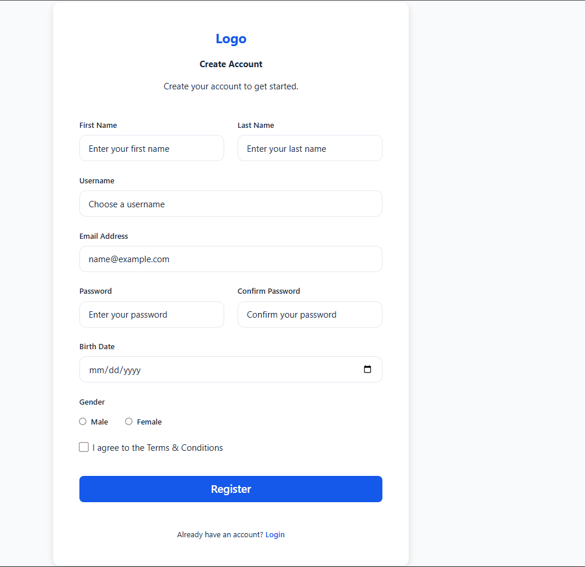
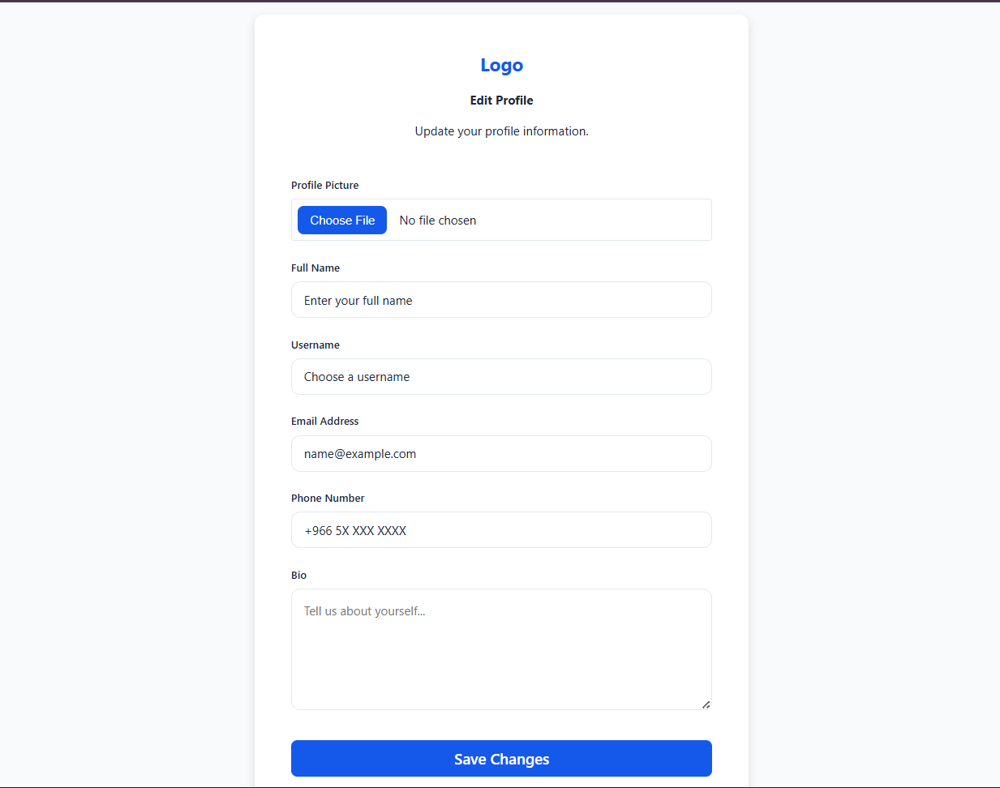
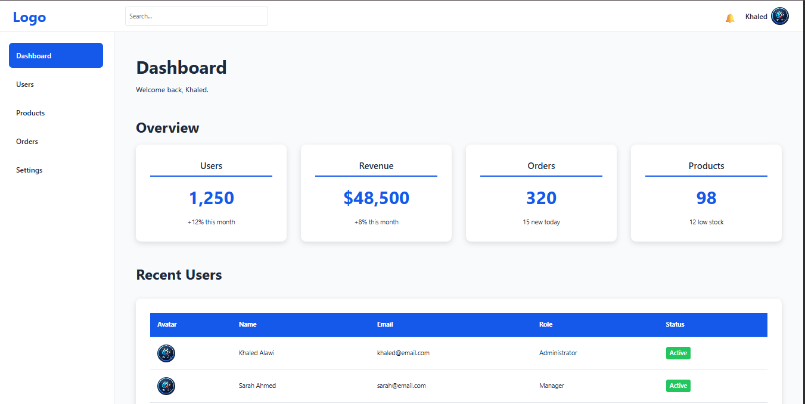

# Stage 01 — Modern HTML & CSS

## Overview

This stage focuses on mastering the HTML and CSS fundamentals that modern frontend developers use every day.

Instead of learning every HTML tag or CSS property, the goal is to master the **20% of concepts that provide 80% of real-world productivity** through hands-on projects.

By the end of this stage, I have built a collection of responsive pages while applying semantic HTML, reusable CSS, Flexbox, responsive design, accessibility, and modern frontend best practices.

---

# Learning Objectives

- Write semantic HTML
- Build accessible forms
- Apply native HTML validation
- Understand the CSS Box Model
- Build layouts using Flexbox
- Create a reusable Design System with CSS Variables
- Build responsive pages
- Organize HTML and CSS using a clean project structure
- Build reusable UI components
- Improve code consistency through refactoring

---

# Project Structure

```text
stage-01-html-css/
│
├── admin-dashboard/
│   ├── index.html
│   └── style.css
│
├── assets/
│   ├── css/
│   │   ├── global.css
│   │   ├── reset.css
│   │   └── variables.css
│   │
│   ├── icons/
│   │
│   └── images/
│       ├── admin-dashboard.png
│       ├── avatar.png
│       ├── login-page.png
│       ├── profile-edit.png
│       └── registration-page.png
│
├── login-page/
│   ├── index.html
│   └── style.css
│
├── profile-edit/
│   ├── index.html
│   └── style.css
│
├── registration-page/
│   ├── index.html
│   └── style.css
│
└── README.md
```

---

# Completed Features

## ✅ Sprint 1 — Design System

### Features

- CSS Variables
- Color Palette
- Typography Scale
- Spacing Scale
- Border Radius
- Shadows
- CSS Reset
- Global Styles

### Concepts Practiced

- Design Tokens
- CSS Variables
- Reusable Styling
- CSS Architecture

---

## ✅ Sprint 2 — Login Page

### Features

- Responsive Login Page
- Email & Password Inputs
- Remember Me Checkbox
- Forgot Password Link
- Native HTML Validation
- Accessible Form Labels
- Keyboard Focus States

### Concepts Practiced

- Semantic HTML
- Forms
- Accessibility
- Validation
- Box Model
- Flexbox
- Responsive Design

---

## ✅ Sprint 3 — Registration Page

### Features

- Registration Form
- First & Last Name
- Username
- Email
- Password & Confirmation
- Birth Date
- Gender Selection
- Terms & Conditions
- Login Link

### Concepts Practiced

- Advanced Forms
- Radio Buttons
- Checkboxes
- Fieldset & Legend
- Native Validation
- Responsive Layouts
- Reusable Components

---

## ✅ Sprint 4 — Profile Edit

### Features

- Profile Picture Upload
- Full Name
- Username
- Email
- Phone Number
- Bio Textarea
- Save Changes Button

### Concepts Practiced

- File Upload
- Textarea
- Custom File Input Styling
- Responsive Forms
- Focus States
- Component Reusability

---

## ✅ Sprint 5 — Dashboard Skeleton

### Features

- Semantic Dashboard Layout
- Header
- Sidebar Navigation
- Main Content
- Footer
- Search Bar
- Notification Button
- User Profile Section

### Concepts Practiced

- Semantic Layout
- Navigation
- Flexbox
- Responsive Structure
- Component Separation

---

## ✅ Sprint 6 — Statistics Cards

### Features

- Users Card
- Revenue Card
- Orders Card
- Products Card
- Hover Animations
- Responsive Card Grid

### Concepts Practiced

- Card Components
- Visual Hierarchy
- Flexbox Layout
- Responsive Design
- CSS Transitions

---

## ✅ Sprint 7 — Recent Users Table

### Features

- Responsive Users Table
- User Avatars
- Name
- Email
- Role
- Status Badges
- Hover Effects
- Horizontal Scrolling on Small Screens

### Concepts Practiced

- Semantic Tables
- Table Alignment
- Badge Components
- Responsive Tables
- Overflow Handling
- Data Presentation

---

## ✅ Sprint 8 — Polish & Refactoring

### Improvements

#### HTML

- Improved semantic structure
- Better heading hierarchy
- Added missing accessibility attributes
- Added table caption
- Added column scopes
- Improved image alt text

#### CSS

- Removed duplicated styles
- Improved selector specificity
- Better naming consistency
- Improved component organization
- Reused design tokens consistently
- Cleaner transitions and hover states

#### UI

- Improved spacing consistency
- Better typography hierarchy
- Better table alignment
- Improved visual consistency
- Refined hover effects
- Improved responsive behavior

### Concepts Practiced

- Code Refactoring
- Accessibility Review
- Semantic HTML
- Maintainable CSS
- Component Consistency
- Production Readiness

---

# Progress

| Sprint | Status |
|---------|--------|
| Design System | ✅ Complete |
| Login Page | ✅ Complete |
| Registration Page | ✅ Complete |
| Profile Edit | ✅ Complete |
| Dashboard Skeleton | ✅ Complete |
| Statistics Cards | ✅ Complete |
| Recent Users Table | ✅ Complete |
| Polish & Refactoring | ✅ Complete |

---

# Technologies Used

- HTML5
- CSS3
- Flexbox
- CSS Variables

---

# Skills Gained

After completing this stage, I can confidently:

- Build semantic HTML documents
- Create accessible forms
- Apply native browser validation
- Build responsive layouts using Flexbox
- Create reusable UI components
- Design reusable Design Systems with CSS Variables
- Build responsive dashboards
- Build responsive data tables
- Write maintainable CSS
- Organize frontend projects
- Improve code quality through refactoring
- Follow modern frontend development best practices

---

# Project Highlights

✔ Semantic HTML

✔ Responsive Layouts

✔ Accessible Forms

✔ Reusable CSS Architecture

✔ CSS Variables Design System

✔ Responsive Dashboard

✔ Statistics Cards

✔ Recent Users Table

✔ Component-Based Styling

✔ Production-Oriented Code Organization

---

# Screenshots

## Login Page


---

## Registration Page



---

## Profile Edit



---

## Admin Dashboard

Includes:

- Dashboard Layout
- Statistics Cards
- Recent Users Table



---

# Author

**Khaled Alawi**

Software Engineering Student

### Learning Path

Java • Spring Boot • React • Full-Stack Development