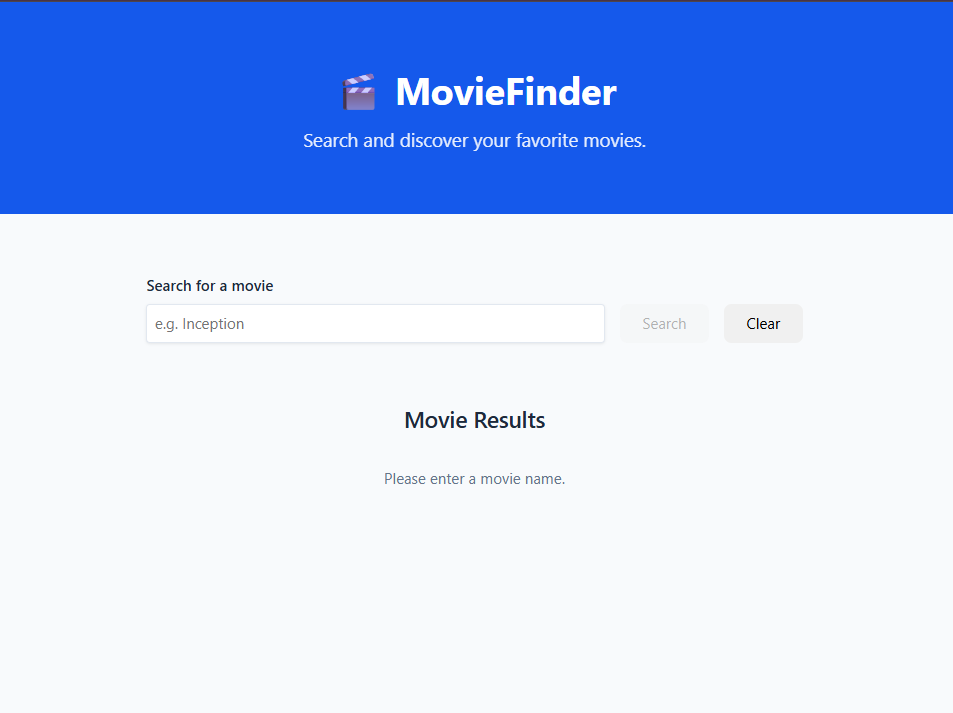
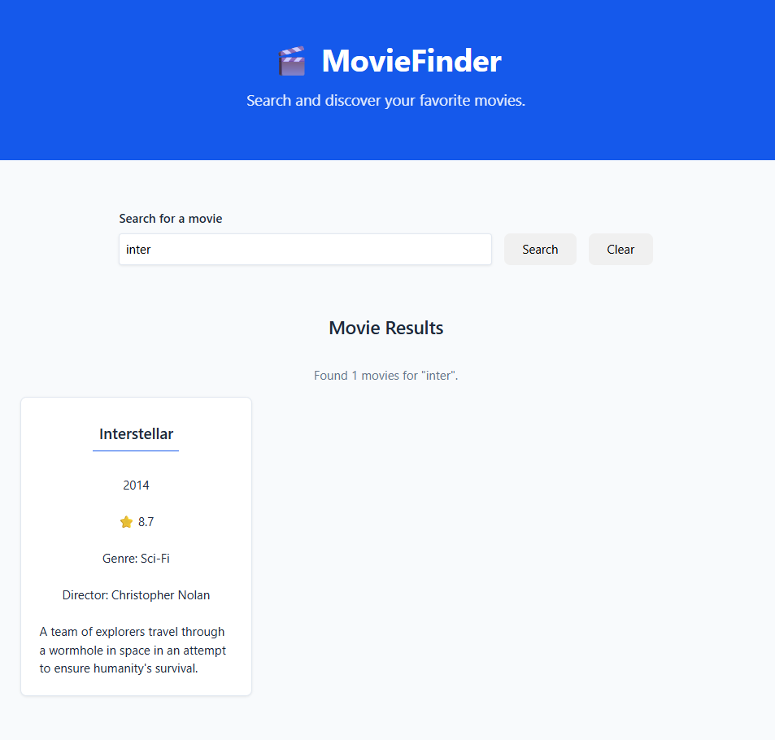
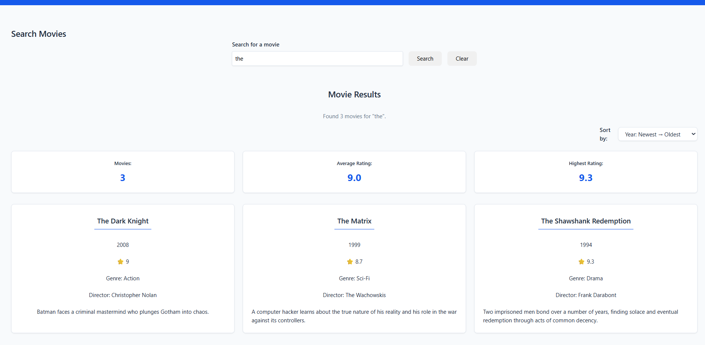
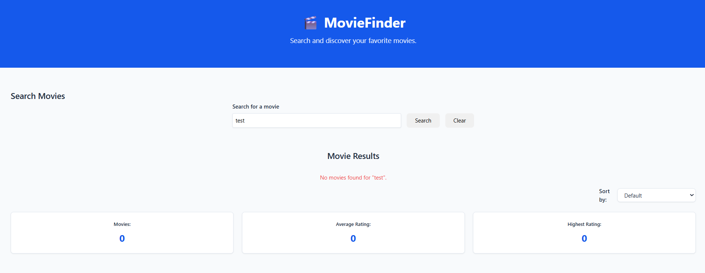

# Stage 3 — Modern JavaScript

## MovieFinder

A movie search application built with **Vanilla JavaScript (ES6+)**.

The purpose of this project is to practice modern JavaScript by building a realistic frontend application before moving to React.

---

## Technologies

- HTML5
- CSS3
- Modern JavaScript (ES6+)
- JavaScript Modules
- DOM API
- Promises
- async / await

---

## Project Goals

This project is designed to turn modern JavaScript knowledge into practical frontend experience.

Instead of studying JavaScript features in isolation, the application uses them inside a realistic project.

---

# Project Structure

```text
stage-03-modern-javascript/
│
├── index.html
├── README.md
│
├── assets/
│   ├── icons/
│   └── images/
│
├── css/
│   ├── components.css
│   └── main.css
│
└── js/
    │
    ├── main.js
    │
    ├── api/
    │   └── movieApi.js
    │
    ├── components/
    │   ├── loading.js
    │   ├── movieCard.js
    │   └── movieList.js
    │
    ├── services/
    │   └── movieService.js
    │
    ├── state/
    │   └── appState.js
    │
    └── utils/
        ├── dom.js
        ├── formatters.js
        └── validators.js
```

---

# Development Progress

## Sprint 1 — Application Foundation

### Completed

Built the initial MovieFinder application structure.

Implemented:

- Application HTML shell
- Header
- Search form
- Movie results section
- JavaScript module entry point
- DOM element selection
- Search form handling
- Application state
- Clear button
- Basic validation
- Loading and error state handling
- Mock movie API
- Movie card component
- Movie list component

### JavaScript Concepts Practiced

- `const`
- `let`
- Arrow functions
- Template literals
- Destructuring
- ES modules
- `async / await`
- Promises
- DOM manipulation
- Event listeners
- Application state

---

# Sprint 2 — Search + Filtering

### Completed

Implemented movie searching and filtering using `filter()`.

The application can search by:

- Movie title
- Movie genre

Search input is normalized before filtering by:

- Removing unnecessary whitespace
- Converting the search term to lowercase

Example:

```js
export function filterMovies(movies, searchTerm) {
  const normalizedSearchTerm = searchTerm.toLowerCase().trim();

  return movies.filter(
    (movie) =>
      movie.title.toLowerCase().includes(normalizedSearchTerm) ||
      movie.genre.toLowerCase().includes(normalizedSearchTerm),
  );
}
```

### Data Flow

```text
User enters search
        ↓
Search Form
        ↓
handleSearch()
        ↓
searchMovies()
        ↓
Movie Array
        ↓
filterMovies()
        ↓
Filtered Movie Array
        ↓
renderMovieList()
        ↓
Movie Cards
```

### JavaScript Concepts Practiced

- `filter()`
- `map()`
- Arrow functions
- Template literals
- String methods
- Event listeners
- Modules
- State management
- Separation of concerns

### Architecture

Filtering logic is kept inside:

```text
js/services/movieService.js
```

Rendering logic is kept inside:

```text
js/components/
```

API logic is kept inside:

```text
js/api/movieApi.js
```

Application orchestration remains inside:

```text
js/main.js
```

This separation keeps the application easier to maintain and prepares the structure for future React development.

---

# Sprint 3 — Sorting + Movie Statistics

### Completed

The application can now sort filtered movies and calculate useful movie statistics.

### Sorting

Implemented:

- Rating: High → Low
- Rating: Low → High
- Year: Newest → Oldest
- Year: Oldest → Newest
- Title: A → Z

The sorting service creates a copy of the movie array before sorting so the original application state is not directly mutated.

```js
const sortedMovies = [...movies];
```

### Movie Statistics

Implemented:

- Total number of movies
- Average movie rating
- Highest movie rating

`reduce()` is used to calculate aggregate information from the movie collection.

Example:

```js
const totalRating = movies.reduce((total, movie) => total + movie.rating, 0);
```

### Additional Array Methods

Practiced in realistic application scenarios:

- `find()` — locating a movie by ID
- `some()` — checking whether an item exists in a collection
- `every()` — checking whether all items satisfy a condition

These methods will become more important in later features such as movie details and favorites.

### Refactoring

As the application became larger, the search logic was separated into smaller responsibilities.

Instead of allowing `handleSearch()` to perform every operation directly, the application now separates:

```text
Search
  ↓
Process Movies
  ↓
Filter
  ↓
Sort
  ↓
Calculate Statistics
  ↓
Render Results
```

This keeps the main application flow easier to understand and maintain.

### Current Sprint Architecture

```text
main.js
   │
   ├── Search
   │
   ├── movieService.js
   │      ├── filterMovies()
   │      ├── sortMovies()
   │      ├── calculateMovieStatistics()
   │      └── findMovieById()
   │
   └── movieList.js
          │
          └── movieCard.js
```

---

# Current Features

- Search movies
- Filter by movie title
- Filter by genre
- Sort movies
- Calculate movie statistics
- Display movie cards
- Clear search
- Handle empty results
- Handle simulated API errors
- Display loading state
- Maintain application state
- Responsive movie grid
- Separate API, service, state, component, and application logic

---

# Upcoming Sprints

## Sprint 4 — Async JavaScript + Real API

Replace the mock movie API with the Spring Boot REST API.

Practice:

- `fetch()`
- Promises
- `async / await`
- HTTP requests
- JSON
- Error handling
- API service architecture

Target architecture:

```text
Browser
   ↓
Fetch API
   ↓
Spring Boot REST API
   ↓
Database
```

---

## Sprint 5 — State + Favorites

Implement:

- Add favorite
- Remove favorite
- Favorite movie list
- Search state
- Loading state
- Error state

Practice:

- Spread operator
- `some()`
- `find()`
- Closures
- State management

---

## Sprint 6 — Production Polish

Improve:

- Loading UI
- Error UI
- Empty states
- Accessibility
- Responsive design
- Form validation
- Code organization
- Reusable functions

---

# Learning Approach

This project follows a build-first approach.

For each feature:

```text
Requirement
    ↓
Explanation
    ↓
Production-style implementation
    ↓
Your task
    ↓
Code review
    ↓
Improvement
    ↓
Git commit
    ↓
Next feature
```

The goal is not simply to understand JavaScript syntax.

The goal is to become comfortable using JavaScript to build frontend applications.

---

# Final Goal

By the end of Stage 3, the application should demonstrate practical knowledge of:

- Modern JavaScript
- ES modules
- Objects and arrays
- Array methods
- DOM manipulation
- State management
- Async JavaScript
- Promises
- `async / await`
- Fetch API
- REST API communication
- Error handling
- Application architecture

The project will also serve as a bridge from:

```text
Vanilla JavaScript
       ↓
Modern JavaScript
       ↓
React
```

---

# Screenshots

## Initial State



## Search Results

Searching for `inter` filters the movie list.



## Sorted Results

Movies can be sorted by rating, year, or title.



## Movie Statistics

The application displays the number of movies, average rating, and highest rating.


## No Results


