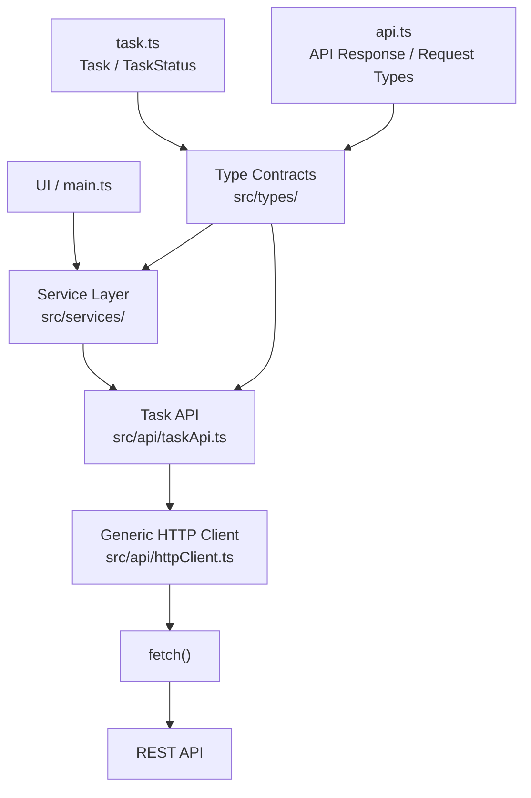

# Task Manager Client

A TypeScript-based frontend project built as the practical project for **Stage 4 — TypeScript** of my Frontend Roadmap.

The goal of this project is to apply TypeScript concepts through a real application instead of learning TypeScript only through isolated exercises.

---

# Stage 4 — TypeScript

## Project Goal

Build a Task Manager API Client while applying the core TypeScript concepts learned throughout Stage 4.

The project focuses on:

- Strong type safety
- Interfaces
- Type aliases
- Union types
- Type narrowing
- Generics
- Enums
- Utility types
- API contracts
- Typed API communication
- Clean project structure
- TypeScript best practices

---

# Tech Stack

- TypeScript
- Vite
- HTML
- CSS
- Fetch API
- npm

---

# Sprint 0 — Project Setup

## Goal

Create the TypeScript project correctly.

## What Was Built

- Created a Vite project using the Vanilla TypeScript template
- Initialized npm
- Installed project dependencies
- Configured TypeScript
- Enabled strict TypeScript checking
- Configured ES modules
- Created the initial project structure
- Added development server support
- Added TypeScript type checking
- Added production build support

## Project Structure

````text
task-manager-client/
│
├── src/
│   ├── api/
│   ├── types/
│   ├── services/
│   ├── utils/
│   ├── main.ts
│   └── style.css
│
├── public/
├── index.html
├── package.json
├── package-lock.json
├── tsconfig.

# Sprint 1 — Domain Model

## Goal

Define the application's data contracts.

This is the first major TypeScript sprint where we begin modeling the actual Task Manager domain before implementing the API and UI layers.

---

## What We Built

- Created the `Task` interface
- Created the `User` interface
- Created the `TaskStatus` type
- Added optional task properties
- Added readonly identifiers
- Applied union types
- Used type-only imports

---

## Concepts Applied

- Interfaces
- Type aliases
- Optional properties
- Union types
- `readonly`
- Primitive types
- Type-only imports
- Type checking

---

## Task Status

Task status is represented using a union type:

```ts
export type TaskStatus =
  | "TODO"
  | "IN_PROGRESS"
  | "COMPLETED";


# Sprint 2 — API Contract Layer

## Goal

Model the REST API used by the Task Manager application.

The purpose of this sprint is to define clear TypeScript contracts for the data exchanged between the frontend and backend **before implementing the HTTP client**.

The main idea is:

```text
Spring Boot DTO
      ↓
    JSON
      ↓
TypeScript API Contract
      ↓
Frontend
````

---

## What We Built

- Created `ApiResponse<T>` generic response type
- Created `TaskResponse`
- Created `TasksResponse`
- Created `CreateTaskRequest`
- Created `UpdateTaskRequest`
- Created `ApiError`
- Reused the existing `Task` and `TaskStatus` domain types
- Used `Record<string, string>` for validation errors
- Applied interfaces intentionally for object contracts
- Applied type aliases for composed/specialized types
- Applied generics for reusable API response structures
- Applied optional properties for partial update requests
- Applied union/literal types for restricted values

---

## API Types Structure

```text
src/
└── types/
    ├── api.ts
    ├── task.ts
    └── user.ts
```

The `api.ts` file contains **API contracts only**.

It does not make HTTP requests.

The actual API implementation will be added later under:

```text
src/api/
```

---

# 1. Generic API Response

The main reusable response contract is:

```ts
export interface ApiResponse<T> {
  success: boolean;
  message: string;
  data: T;
}
```

The generic `T` represents the type of the `data` property.

For example:

```ts
ApiResponse<Task>;
```

means:

```text
data → Task
```

while:

```ts
ApiResponse<Task[]>;
```

means:

```text
data → Task[]
```

This allows us to define the common response structure **once** instead of duplicating it for every resource.

---

# 2. Task Response

A response containing one task is:

```ts
export type TaskResponse = ApiResponse<Task>;
```

Conceptually:

```text
TaskResponse
├── success → boolean
├── message → string
└── data    → Task
```

Example:

```ts
const response: TaskResponse = {
  success: true,
  message: "Task retrieved",
  data: {
    id: 1,
    title: "Learn TypeScript",
    completed: false,
    status: "IN_PROGRESS",
  },
};
```

---

# 3. Tasks Response

A response containing multiple tasks is:

```ts
export type TasksResponse = ApiResponse<Task[]>;
```

Here:

```text
data → Task[]
```

Example:

```ts
const response: TasksResponse = {
  success: true,
  message: "Tasks retrieved",
  data: [
    {
      id: 1,
      title: "Learn TypeScript",
      completed: false,
      status: "IN_PROGRESS",
    },
    {
      id: 2,
      title: "Build API Client",
      completed: false,
      status: "TODO",
    },
  ],
};
```

---

# 4. Create Task Request

The frontend does not need to send the complete `Task` object when creating a task.

We define:

```ts
export interface CreateTaskRequest {
  title: string;
  description?: string;
}
```

Example:

```ts
const request: CreateTaskRequest = {
  title: "Learn TypeScript API Contracts",
  description: "Practice REST API typing",
};
```

The backend can generate or determine values such as:

```text
id
completed
status
```

This is why `CreateTaskRequest` is separate from `Task`.

---

# 5. Update Task Request

An update may modify only some fields:

```ts
export interface UpdateTaskRequest {
  title?: string;
  description?: string;
  completed?: boolean;
  status?: TaskStatus;
}
```

Example:

```ts
const request: UpdateTaskRequest = {
  completed: true,
};
```

Another example:

```ts
const request: UpdateTaskRequest = {
  title: "Learn Advanced TypeScript",
  status: "IN_PROGRESS",
};
```

All properties are optional because an update does not necessarily modify every field.

---

# 6. API Error

Validation and other API errors are represented by:

```ts
export interface ApiError {
  success: false;
  message: string;
  errors: Record<string, string>;
}
```

Example:

```ts
const error: ApiError = {
  success: false,
  message: "Validation failed",
  errors: {
    title: "Title is required",
    email: "Invalid email address",
  },
};
```

Notice:

```ts
success: false;
```

rather than:

```ts
success: boolean;
```

because this specific contract represents a failed response.

---

# 7. Why `Record<string, string>`?

We already learned `Record` in the Utility Types lesson.

```ts
Record<string, string>;
```

means approximately:

```text
keys   → string
values → string
```

So this is valid:

```ts
const errors: Record<string, string> = {
  title: "Title is required",
  email: "Invalid email address",
  message: "Message is too long",
};
```

This is conceptually similar to the Spring Boot type:

```java
Map<String, String>
```

So:

```text
Java                         TypeScript

Map<String, String>    →     Record<string, string>
```

---

# 8. Interface vs Type Alias

We intentionally use both.

### Interfaces

Used for object contracts:

```ts
interface CreateTaskRequest {
  title: string;
  description?: string;
}
```

```ts
interface UpdateTaskRequest {
  title?: string;
  description?: string;
  completed?: boolean;
  status?: TaskStatus;
}
```

```ts
interface ApiError {
  success: false;
  message: string;
  errors: Record<string, string>;
}
```

### Type Aliases

Used for specialized/composed types:

```ts
type TaskResponse = ApiResponse<Task>;

type TasksResponse = ApiResponse<Task[]>;
```

This follows the rule from Sprint 1:

> **Choose the type representation intentionally.**

---

# 9. Backend Connection

Our API contract layer represents the JSON exchanged with the Spring Boot backend.

The flow is:

```text
Spring Boot DTO
       ↓
      JSON
       ↓
TypeScript Interface / Type
       ↓
Frontend API Client
```

For example:

```text
Spring Boot
CreateTaskRequest
       ↓
      JSON
       ↓
TypeScript
CreateTaskRequest
```

And:

```text
Spring Boot
Map<String, String>
       ↓
      JSON
       ↓
TypeScript
Record<string, string>
```

The goal is **not** to copy Java classes directly.

The goal is to accurately represent the API contract on the frontend.

---

# 10. API Contracts vs API Implementation

These are deliberately separated.

```text
src/types/api.ts
        ↓
What the API data looks like
```

while:

```text
src/api/
        ↓
How we communicate with the API
```

So:

```text
types/api.ts
    = contracts

api/taskApi.ts
    = implementation
```

We will build the actual HTTP implementation in **Sprint 3**.

---

# 11. Example Contract Flow

### Single Task

```text
Backend
   ↓
JSON
   ↓
ApiResponse<Task>
   ↓
TaskResponse
   ↓
Typed API Client
   ↓
Frontend
```

### Multiple Tasks

```text
Backend
   ↓
JSON
   ↓
ApiResponse<Task[]>
   ↓
TasksResponse
   ↓
Typed API Client
   ↓
Frontend
```

---

# 12. Concepts Applied

This sprint applies:

- **Generics**
- **Interfaces**
- **Type aliases**
- **Optional properties**
- **Union/literal types**
- **`Record`**
- **API contracts**
- **Backend/frontend DTO mapping**

---

# 13. Verification

Run:

```bash
npm run type-check
```

Then:

```bash
npm run build
```

And verify the application still runs:

```bash
npm run dev
```

You should also deliberately test invalid values.

### Invalid create request

```ts
const request: CreateTaskRequest = {
  title: 123,
};
```

### Invalid update request

```ts
const request: UpdateTaskRequest = {
  status: "DONE",
};
```

### Invalid API error

```ts
const error: ApiError = {
  success: true,
  message: "Validation failed",
  errors: {},
};
```

TypeScript should reject all three.

---

# Deliverable

A complete API contract layer:

```text
src/
└── types/
    ├── api.ts
    ├── task.ts
    └── user.ts
```

The layer now defines:

- `ApiResponse<T>`
- `TaskResponse`
- `TasksResponse`
- `CreateTaskRequest`
- `UpdateTaskRequest`
- `ApiError`

---

# Sprint Result

The Task Manager frontend now has a clear, strongly typed contract for communicating with the future REST API.

We have separated:

```text
Domain Model
     ↓
API Contract
     ↓
API Implementation
```

This gives Sprint 3 a clean foundation.

---

# Git Commit

```text
feat: define typed API contracts
```

# Sprint 3 — HTTP Client

## Goal

Build the low-level HTTP communication layer.

The purpose of this sprint is to create a reusable HTTP client instead of repeating `fetch()` logic throughout the application.

The architecture becomes:

```text
UI
 ↓
Service
 ↓
API Client
 ↓
fetch()
 ↓
REST API
```

---

## What We Built

- Created a reusable `httpClient.ts`
- Created a generic `request<T>()` function
- Added support for `RequestInit`
- Used `async/await`
- Used `Promise<T>`
- Added HTTP error handling
- Added `unknown` for untrusted API error data
- Added an `ApiError` type guard
- Reused the `ApiError` contract from Sprint 2
- Applied generic type inference
- Kept the HTTP client independent from specific resources such as tasks or users

---

## HTTP Client Structure

```text
src/
├── api/
│   └── httpClient.ts
│
└── types/
    ├── api.ts
    ├── task.ts
    └── user.ts
```

The `httpClient.ts` file contains generic HTTP communication logic.

It does not contain task-specific operations such as:

```text
getTasks()
createTask()
updateTask()
deleteTask()
```

Those will belong to the API/service layers introduced in later sprints.

---

# Generic Request Function

The core function is:

```ts
export async function request<T>(
  url: string,
  options?: RequestInit,
): Promise<T> {
  const response = await fetch(url, options);

  if (!response.ok) {
    throw await createApiError(response);
  }

  return (await response.json()) as T;
}
```

The generic type parameter `T` represents the expected response type.

For example:

```ts
request<Task>();
```

means:

```text
T = Task
```

so the function returns:

```text
Promise<Task>
```

While:

```ts
request<Task[]>();
```

means:

```text
T = Task[]
```

so the function returns:

```text
Promise<Task[]>
```

This allows one HTTP implementation to support many resources.

---

# Why `Promise<T>`?

An HTTP request is asynchronous.

Therefore:

```ts
request<Task>();
```

does not immediately return a `Task`.

It returns:

```text
Promise<Task>
```

After using:

```ts
const task = await request<Task>(url);
```

the `await` resolves the Promise and gives:

```text
task → Task
```

The flow is:

```text
request<Task>()
      ↓
Promise<Task>
      ↓ await
Task
```

For an array:

```text
request<Task[]>()
      ↓
Promise<Task[]>
      ↓ await
Task[]
```

---

# `async` / `await`

The HTTP client uses:

```ts
async;
```

because `fetch()` is asynchronous.

Example:

```ts
const response = await fetch(url, options);
```

The `await` pauses the current async function until the Promise is fulfilled or rejected.

This gives us readable asynchronous code without manually chaining `.then()` calls.

---

# Request Options

The function accepts:

```ts
options?: RequestInit
```

`RequestInit` is a built-in browser type describing options accepted by `fetch()`.

It can contain things such as:

```ts
{
  method: "POST",
  headers: {
    "Content-Type": "application/json"
  },
  body: JSON.stringify(data)
}
```

The `?` means the options are optional.

This allows both:

```ts
request<Task>("/api/tasks/1");
```

and:

```ts
request<Task>("/api/tasks", {
  method: "POST",
  headers: {
    "Content-Type": "application/json",
  },
  body: JSON.stringify(request),
});
```

---

# HTTP Error Handling

The client checks:

```ts
if (!response.ok) {
  throw await createApiError(response);
}
```

This prevents unsuccessful HTTP responses from being treated as successful data.

The response may represent errors such as:

```text
400 Bad Request
401 Unauthorized
403 Forbidden
404 Not Found
500 Internal Server Error
```

Instead of handling these individually in every API function, the HTTP client provides one common error path.

---

# API Error Handling

The client reuses the `ApiError` contract created in Sprint 2:

```ts
export interface ApiError {
  success: false;
  message: string;
  errors: Record<string, string>;
}
```

When an HTTP error occurs, the client attempts to read the backend's JSON error response.

---

# Why `unknown`?

The backend response is external data.

Before validation, we cannot safely assume its type.

Therefore:

```ts
const errorData: unknown = await response.json();
```

is preferred over:

```ts
const errorData: any = await response.json();
```

`unknown` forces us to verify the value before using it.

This supports the Stage 4 mastery goal:

> **No unnecessary `any`.**

---

# API Error Type Guard

The client uses a type guard:

```ts
function isApiError(value: unknown): value is ApiError {
  // validation
}
```

The expression:

```ts
value is ApiError
```

is a TypeScript type predicate.

It tells TypeScript:

> If this function returns `true`, treat `value` as an `ApiError`.

The validation uses techniques learned earlier:

- `typeof`
- `null` checks
- `in` operator
- literal value comparison

For example:

```ts
if (typeof value !== "object" || value === null) {
  return false;
}
```

Then required properties are checked:

```ts
if (!("success" in value) || !("message" in value) || !("errors" in value)) {
  return false;
}
```

Finally, the important values are checked:

```ts
return (
  value.success === false &&
  typeof value.message === "string" &&
  typeof value.errors === "object" &&
  value.errors !== null
);
```

---

# Fallback Error

The backend might fail to return valid JSON.

For example:

```text
500 Internal Server Error
```

with an empty or non-JSON body.

In that case, the HTTP client creates a fallback error:

```ts
return {
  success: false,
  message: `Request failed with status ${response.status}.`,
  errors: {},
};
```

This means the caller still receives a consistent `ApiError` structure.

---

# Important TypeScript Concept

The following line:

```ts
return (await response.json()) as T;
```

uses a **type assertion**.

It tells TypeScript:

> Treat the parsed response as the expected type `T`.

For example:

```ts
request<Task>();
```

results in:

```ts
response.json() as Task;
```

However, this does **not** perform runtime validation.

The frontend is expressing what it expects the backend to return.

This distinction is important:

```text
TypeScript
    ↓
compile-time type information

Backend JSON
    ↓
runtime data
```

If runtime schema validation is needed later, it can be introduced as a separate concern.

---

# Generic Reuse

The main advantage of the HTTP client is that the same function can support many response types.

### One Task

```ts
const task = await request<Task>("/api/tasks/1");
```

Result:

```text
task → Task
```

### Multiple Tasks

```ts
const tasks = await request<Task[]>("/api/tasks");
```

Result:

```text
tasks → Task[]
```

### One User

```ts
const user = await request<User>("/api/users/1");
```

Result:

```text
user → User
```

### Multiple Users

```ts
const users = await request<User[]>("/api/users");
```

Result:

```text
users → User[]
```

The HTTP implementation does not need separate functions for each resource.

---

# Architecture Decision

The HTTP client remains generic.

It should not contain:

```text
getTasks()
createTask()
deleteTask()
```

because those functions belong to the task-specific API/service layers.

The separation is:

```text
httpClient.ts
    ↓
Generic HTTP infrastructure

taskApi.ts
    ↓
Task-specific API operations

taskService.ts
    ↓
Application-level task operations
```

This keeps responsibilities separated.

---

# Backend Connection

The data flow is now:

```text
Spring Boot REST API
        ↓
       JSON
        ↓
TypeScript API Contract
        ↓
   request<T>()
        ↓
Typed application data
```

For example:

```ts
const task = await request<Task>("/api/tasks/1");
```

The expected flow is:

```text
HTTP response
      ↓
JSON
      ↓
Task
      ↓
Promise<Task>
      ↓ await
Task
```

---

# Concepts Applied

This sprint reinforces:

- Generics
- `Promise<T>`
- `async`
- `await`
- `fetch()`
- `RequestInit`
- Type inference
- `unknown`
- Type assertions
- Type guards
- API contracts
- Error handling
- ES modules

---

# Deliverable

A reusable HTTP client:

```text
src/
└── api/
    └── httpClient.ts
```

The client can make typed requests such as:

```ts
request<Task>();
request<Task[]>();
request<User>();
request<User[]>();
```

while keeping HTTP logic independent from specific resources.

---

# Verification

The following should pass:

```bash
npm run type-check
```

```bash
npm run build
```

The application should still run:

```bash
npm run dev
```

The generic client should also be testable with different types.

Examples:

```ts
request<Task>();
request<Task[]>();
request<User>();
request<User[]>();
```

---

# Sprint Result

The project now has the low-level HTTP communication layer required to communicate with a REST API.

The architecture is now:

```text
UI
 ↓
Service
 ↓
API Client
 ↓
fetch()
 ↓
REST API
```

The API client is reusable and strongly typed, while task-specific API operations are intentionally left for the next sprint.

---

# Git Commit

```text
feat: add typed HTTP client
```

# Sprint 4 — Task API Service

## Goal

Build the actual Task-specific API operations on top of the reusable HTTP client created in Sprint 3.

The goal is to move from:

```text
Generic HTTP communication
```

to:

```text
Task-specific API operations
```

---

## What We Built

- Created `taskApi.ts`
- Implemented `getTasks()`
- Implemented `getTaskById()`
- Implemented `createTask()`
- Implemented `updateTask()`
- Implemented `deleteTask()`
- Reused the generic `request<T>()` HTTP client
- Reused the API contract types from Sprint 2
- Added typed function parameters
- Added typed return values
- Used `Promise<T>`
- Used `async/await`
- Added JSON request bodies for `POST` and `PATCH`
- Added support for `204 No Content` responses
- Kept task-specific API logic separate from generic HTTP infrastructure

---

# Current Project Architecture

The project now follows this structure:

```text
task-manager-client/
│
├── src/
│   │
│   ├── api/
│   │   ├── httpClient.ts
│   │   └── taskApi.ts
│   │
│   ├── services/
│   │
│   ├── types/
│   │   ├── api.ts
│   │   ├── task.ts
│   │   └── user.ts
│   │
│   ├── utils/
│   │
│   ├── main.ts
│   └── style.css
│
├── public/
│
├── index.html
├── package.json
├── package-lock.json
├── tsconfig.json
├── vite.config.ts
└── README.md
```

---

# Architecture Diagram



The important flow is:

```text
UI
 ↓
Service Layer
 ↓
Task API
 ↓
HTTP Client
 ↓
fetch()
 ↓
REST API
```

And the type contracts support the layers:

```text
types/
 ↓
Task API + Services
```

---

# API Layer vs HTTP Client

These two files have different responsibilities.

## `httpClient.ts`

The HTTP client is generic.

It provides:

```ts
request<T>();
```

and handles things such as:

- `fetch()`
- HTTP status checking
- JSON parsing
- API error handling
- generic response typing
- `204 No Content`

It does **not** know anything about Tasks.

---

## `taskApi.ts`

The Task API is resource-specific.

It knows:

- Task endpoints
- Task request types
- Task response types
- HTTP methods used by Task operations

For example:

```ts
getTasks();
getTaskById();
createTask();
updateTask();
deleteTask();
```

So:

```text
httpClient.ts
    ↓
generic infrastructure

taskApi.ts
    ↓
Task-specific API operations
```

---

# Task API Endpoints

The current API contract is:

| Operation     | HTTP Method | Endpoint          |
| ------------- | ----------- | ----------------- |
| Get all tasks | `GET`       | `/api/tasks`      |
| Get one task  | `GET`       | `/api/tasks/{id}` |
| Create task   | `POST`      | `/api/tasks`      |
| Update task   | `PATCH`     | `/api/tasks/{id}` |
| Delete task   | `DELETE`    | `/api/tasks/{id}` |

These endpoints represent the current learning-project API design.

The actual backend contract will be the source of truth when a real backend is connected.

---

# `getTasks()`

The function:

```ts
export async function getTasks(): Promise<Task[]> {
  const response = await request<TasksResponse>("/api/tasks");

  return response.data;
}
```

The important distinction is:

```text
request<TasksResponse>()
        ↓
Promise<TasksResponse>
        ↓ await
TasksResponse
        ↓ .data
Task[]
```

Therefore the API function exposes:

```ts
Promise<Task[]>;
```

to the rest of the application instead of exposing the raw API response wrapper.

---

# `getTaskById()`

```ts
export async function getTaskById(id: number): Promise<Task> {
  const response = await request<TaskResponse>(`/api/tasks/${id}`);

  return response.data;
}
```

The function:

- accepts a numeric task ID
- sends a `GET` request
- expects `TaskResponse`
- returns the actual `Task`

---

# `createTask()`

```ts
export async function createTask(
  requestData: CreateTaskRequest,
): Promise<Task> {
  const response = await request<TaskResponse>("/api/tasks", {
    method: "POST",
    headers: {
      "Content-Type": "application/json",
    },
    body: JSON.stringify(requestData),
  });

  return response.data;
}
```

The important contract is:

```text
CreateTaskRequest
        ↓
JSON
        ↓
POST /api/tasks
        ↓
TaskResponse
        ↓
Task
```

The function doesn't accept a complete `Task` because properties such as the ID are controlled by the backend.

---

# `updateTask()`

```ts
export async function updateTask(
  id: number,
  requestData: UpdateTaskRequest,
): Promise<Task> {
  const response = await request<TaskResponse>(`/api/tasks/${id}`, {
    method: "PATCH",
    headers: {
      "Content-Type": "application/json",
    },
    body: JSON.stringify(requestData),
  });

  return response.data;
}
```

`PATCH` is used because the current `UpdateTaskRequest` represents a partial update:

```ts
interface UpdateTaskRequest {
  title?: string;
  description?: string;
  completed?: boolean;
  status?: TaskStatus;
}
```

For example:

```ts
await updateTask(10, {
  completed: true,
});
```

Only the changed field needs to be sent.

If the real backend uses `PUT` instead, the frontend must follow the actual backend contract.

---

# `deleteTask()`

```ts
export async function deleteTask(id: number): Promise<void> {
  await request<void>(`/api/tasks/${id}`, {
    method: "DELETE",
  });
}
```

This operation does not return meaningful data.

The expected flow is:

```text
DELETE /api/tasks/10
        ↓
204 No Content
        ↓
request<void>()
        ↓
Promise<void>
```

---

# 204 No Content

Sprint 4 also exposed an important limitation in the original HTTP client.

The original implementation always attempted:

```ts
response.json();
```

But a successful `204 No Content` response has no JSON body.

Therefore the HTTP client was updated to handle:

```ts
if (response.status === 204) {
  return undefined as T;
}
```

This allows:

```ts
request<void>();
```

to be used for operations with no response body.

---

# TypeScript Concepts Applied

This sprint combines many of the concepts from the previous lessons.

## Interfaces

Request and response contracts:

```ts
CreateTaskRequest;
UpdateTaskRequest;
TaskResponse;
TasksResponse;
```

---

## Type Aliases

Specialized response types:

```ts
type TaskResponse = ApiResponse<Task>;

type TasksResponse = ApiResponse<Task[]>;
```

---

## Generics

The HTTP client remains reusable:

```ts
request<Task>();
request<Task[]>();
request<User>();
request<User[]>();
request<void>();
```

---

## `Promise<T>`

Every asynchronous API operation has an explicit result type.

Examples:

```ts
Promise<Task[]>;
Promise<Task>;
Promise<void>;
```

---

## `async/await`

Used to make asynchronous HTTP code easier to read:

```ts
const response = await request<TaskResponse>(...);
```

---

## Function Parameter Types

Examples:

```ts
id: number;
```

```ts
requestData: CreateTaskRequest;
```

This prevents invalid values from being passed to the API functions.

---

## Return Types

Examples:

```ts
Promise<Task[]>;
Promise<Task>;
Promise<void>;
```

The caller knows exactly what to expect.

---

# Error Handling

The Task API does not duplicate error parsing.

If `request<T>()` encounters an HTTP error:

```text
Task API
   ↓
request<T>()
   ↓
HTTP error
   ↓
ApiError
   ↓
throw
```

The error can then be handled by the service or UI layer.

This keeps the responsibilities separated.

---

# Complete Type Flow

## Get Tasks

```text
GET /api/tasks
       ↓
TasksResponse
       ↓
response.data
       ↓
Task[]
       ↓
Promise<Task[]>
```

## Get One Task

```text
GET /api/tasks/{id}
       ↓
TaskResponse
       ↓
response.data
       ↓
Task
       ↓
Promise<Task>
```

## Create Task

```text
CreateTaskRequest
       ↓
JSON
       ↓
POST /api/tasks
       ↓
TaskResponse
       ↓
Task
       ↓
Promise<Task>
```

## Update Task

```text
UpdateTaskRequest
       ↓
JSON
       ↓
PATCH /api/tasks/{id}
       ↓
TaskResponse
       ↓
Task
       ↓
Promise<Task>
```

## Delete Task

```text
DELETE /api/tasks/{id}
       ↓
204 No Content
       ↓
Promise<void>
```

---

# Why This Layer Exists

Without `taskApi.ts`, application code would repeatedly contain:

```ts
fetch(...)
```

along with:

- endpoint URLs
- HTTP methods
- headers
- request bodies
- response types
- JSON parsing

Now the rest of the application can simply call:

```ts
getTasks();
getTaskById(1);
createTask(request);
updateTask(1, request);
deleteTask(1);
```

This makes the rest of the application independent from the details of HTTP communication.

---

# Deliverable

A clean Task API layer:

```text
src/
└── api/
    ├── httpClient.ts
    └── taskApi.ts
```

The layer now provides:

```text
getTasks()
getTaskById()
createTask()
updateTask()
deleteTask()
```

using the typed HTTP client and API contracts created in the previous sprints.

---

# Verification

The following should pass:

```bash
npm run type-check
```

```bash
npm run build
```

The application should still run with:

```bash
npm run dev
```

The API functions should have the expected types:

```ts
getTasks()
  // Promise<Task[]>

getTaskById(1)
  // Promise<Task>

createTask(...)
  // Promise<Task>

updateTask(1, ...)
  // Promise<Task>

deleteTask(1)
  // Promise<void>
```

---

# Sprint Result

The project now has a complete resource-specific API layer.

The architecture currently is:

```text
UI
 ↓
Service Layer
 ↓
Task API
 ↓
HTTP Client
 ↓
fetch()
 ↓
REST API
```

The next sprint will focus on the **Service/Application State layer**, where we start modeling states such as:

```text
idle
loading
success
error
```

using the union and discriminated-union concepts from the TypeScript lessons.

---

# Git Commit

```text
feat: implement task API service
```

# Sprint 5 — Application State

## Goal

Represent task loading states safely using TypeScript discriminated unions.

Instead of using an unsafe generic string:

```ts
let status: string;
```

the application uses a strongly typed state model that represents the valid task loading states.

---

## Task State

The application state is represented using a discriminated union:

```ts
export type TaskState =
  | { status: "idle" }
  | { status: "loading" }
  | { status: "success"; data: Task[] }
  | { status: "error"; message: string };
```

The application can now safely represent four states:

- `idle` — no request has started
- `loading` — tasks are currently being loaded
- `success` — tasks were successfully loaded
- `error` — loading failed

Each state contains only the data that makes sense for that state.

---

## Concepts Practiced

### Union Types

`TaskState` can be one of several different object types.

```ts
type TaskState =
  | { status: "idle" }
  | { status: "loading" }
  | { status: "success"; data: Task[] }
  | { status: "error"; message: string };
```

---

### Literal Types

The `status` property uses specific literal values:

```ts
"idle";
"loading";
"success";
"error";
```

instead of a generic:

```ts
string;
```

This prevents invalid states.

---

### Discriminated Unions

The `status` property acts as the **discriminant**.

It tells TypeScript which member of the union is currently being used.

```text
TaskState
    |
    +-- status: "idle"
    |
    +-- status: "loading"
    |
    +-- status: "success" → data
    |
    +-- status: "error"   → message
```

---

### Type Narrowing

Checking the discriminant allows TypeScript to narrow the state to the correct type.

```ts
if (state.status === "success") {
  state.data;
}
```

Inside this block, TypeScript knows that `state` is:

```ts
{
  status: "success";
  data: Task[];
}
```

Similarly:

```ts
if (state.status === "error") {
  state.message;
}
```

TypeScript knows that `message` is available.

---

### Exhaustive Handling

The application uses `never` to make state handling exhaustive.

```ts
export function assertNever(value: never): never {
  throw new Error(`Unexpected value: ${value}`);
}
```

Example:

```ts
function getTaskStateMessage(state: TaskState): string {
  if (state.status === "success") {
    if (state.data.length === 0) {
      return "No tasks found";
    }

    return `Loaded ${state.data.length} tasks`;
  }

  if (state.status === "error") {
    return `Failed: ${state.message}`;
  }

  if (state.status === "loading") {
    return "Loading tasks...";
  }

  if (state.status === "idle") {
    return "Waiting to load tasks";
  }

  return assertNever(state);
}
```

If a new state is added to `TaskState` without being handled, TypeScript will report an error at `assertNever(state)`.

This provides compile-time protection against missing state handling.

---

## Files

```text
src/
├── types/
│   └── app.ts
│
├── utils/
│   └── assertNever.ts
│
└── main.ts
```

### `src/types/app.ts`

Contains the `TaskState` discriminated union.

### `src/utils/assertNever.ts`

Contains the exhaustive handling helper.

### `src/main.ts`

Uses `TaskState` and demonstrates type narrowing and exhaustive state handling.

---

## State Flow

```text
        ┌─────────┐
        │  idle   │
        └────┬────┘
             │
             ▼
        ┌─────────┐
        │ loading │
        └────┬────┘
             │
       ┌─────┴─────┐
       ▼           ▼
  ┌─────────┐  ┌─────────┐
  │ success │  │  error  │
  └─────────┘  └─────────┘
```

---

## Key Learning

The main lesson from this sprint is:

> Use discriminated unions when an application can be in one of several distinct states.

Instead of:

```ts
status: string;
data?: Task[];
message?: string;
```

we model the valid states explicitly:

```ts
type TaskState =
  | { status: "idle" }
  | { status: "loading" }
  | { status: "success"; data: Task[] }
  | { status: "error"; message: string };
```

This gives TypeScript enough information to detect invalid states and safely narrow the state during application logic.

---

## Deliverable

- [x] Typed application state
- [x] Task loading states
- [x] Discriminated union
- [x] Type narrowing
- [x] Exhaustive handling
- [x] `assertNever()` helper

---

## Git Commit

```text
feat: add typed task loading states

```

# Sprint 6 — Task List UI

## Goal

Render tasks dynamically using TypeScript.

The application now takes typed `Task` objects and converts them into interactive DOM elements.

## What We Built

- Dynamic task list rendering
- Task cards
- Task title
- Task description
- Task status
- Completed state
- Complete / incomplete action
- Mark as In Progress action
- Dynamic status styling
- Dynamic completed styling
- Typed DOM elements
- DOM event handling

## Concepts Applied

- Arrays of interfaces
- Functions
- Function parameters and return types
- DOM APIs
- `HTMLElement`
- `HTMLSpanElement`
- `HTMLButtonElement`
- Nullable values
- Type narrowing
- Event handling
- Dynamic DOM updates
- `map()`
- Conditional rendering

## Main Functions

### `renderTask()`

```ts
function renderTask(task: Task): HTMLElement;
```

Creates a complete task card from a typed `Task`.

### `renderTasks()`

```ts
function renderTasks(tasks: Task[]): HTMLElement[];
```

Maps all tasks into task card elements.

### Status Rendering

The task status is represented visually using different CSS classes:

```text
TODO
    ↓
status-todo

IN_PROGRESS
    ↓
status-in-progress

COMPLETED
    ↓
status-completed
```

### Completed State

When a task is completed:

- The task is marked as completed.
- The task title receives a line-through style.
- The card becomes visually muted.
- The status changes to `COMPLETED`.
- The button changes to `Mark as Incomplete`.

## Application Flow

```text
Task[]
   ↓
renderTasks()
   ↓
renderTask(task)
   ↓
Create DOM elements
   ↓
Task Card
   ├── Title
   ├── Description
   ├── Status
   ├── Completed State
   └── Actions
        ├── Mark as Complete / Incomplete
        └── Mark as In Progress
```

## Key Learning

This sprint moved TypeScript from **data modeling** into **real application behavior**.

Instead of only defining:

```ts
interface Task {
  ...
}
```

we now use `Task` to type actual UI functions:

```ts
function renderTask(task: Task): HTMLElement;
```

This gives us compile-time safety while working with the DOM.

## Deliverable

A working typed task list with interactive task status and completion actions.

## Git Commit

```text
feat: render typed task list
```

# Sprint 7 — Create / Edit Task

## Goal

Build a typed task form that supports creating new tasks and editing existing tasks.

## Features

- Create a new task
- Edit an existing task
- Populate the form when editing
- Validate task title
- Submit typed request objects
- Connect the form to the Task API
- Reload the task list after create/update
- Handle API errors

## Files

```text
src/
├── api/
│   └── taskApi.ts
│
├── types/
│   ├── task.ts
│   └── api.ts
│
└── ui/
    └── taskForm.ts
```

## Create Task

The form creates a `CreateTaskRequest`:

```ts
const request: CreateTaskRequest = {
  title,
  description: description || undefined,
};
```

The request is sent through:

```text
Task Form
    ↓
createTask()
    ↓
taskApi.ts
    ↓
httpClient.ts
    ↓
Backend
```

## Edit Task

When a `Task` is passed to the form:

```ts
renderTaskForm(task);
```

the form enters edit mode.

The existing task data is loaded into the inputs:

```ts
titleInput.value = task.title;
descriptionInput.value = task.description ?? "";
```

The form then creates an `UpdateTaskRequest` and calls:

```ts
updateTask(task.id, request);
```

## Validation

The title is required and must contain at least three characters.

```ts
if (title.length < 3) {
  titleInput.focus();
  return;
}
```

## Important TypeScript Concepts

- Interfaces
- Optional properties
- Function parameters
- Return types
- DOM types
- Form events
- Type narrowing
- Request DTOs
- `async/await`
- `Promise<T>`
- Error handling

## Important Design Concept

The form does **not** use `Task` as the request object.

Instead:

```text
Task
↓
Represents an existing task

CreateTaskRequest
↓
Represents data needed to create a task

UpdateTaskRequest
↓
Represents data that can be changed
```

This keeps the frontend API contracts clear and prevents accidentally sending fields such as `id` when creating a task.

## Deliverable

A working task form supporting:

- Create Task
- Edit Task
- Validation
- API integration
- Task list refresh after changes

## Git Commit

```bash
git commit -m "feat: add task create and edit forms"
```

# Sprint 8 — Search + Filtering

## Goal

Add task search and status filtering to the Task Manager application.

## Features

- Search tasks by title.
- Filter tasks by status.
- Combine search and status filtering.
- Dynamically update the task list when the search or filter changes.

## Implementation

### Task Filter

Created a `TaskFilter` union type:

```ts
type TaskFilter = "ALL" | "TODO" | "IN_PROGRESS" | "COMPLETED";
```

### Filtering Functions

Created typed utility functions:

- `filterTasks()` — filters tasks by status.
- `searchTasks()` — searches tasks by title.
- `getFilteredTasks()` — combines status filtering and title searching.

### UI

Added:

- Search input.
- Status filter dropdown.
- Dynamic task list rendering.

The task list is re-rendered whenever:

- The user types in the search field.
- The user changes the status filter.

## Concepts Applied

- Union types
- Type aliases
- Arrays
- Higher-order functions
- `Array.filter()`
- Type inference
- Typed DOM elements
- Event handling
- Separation of UI and business logic

## Application Flow

```text
Task[]
   ↓
getFilteredTasks()
   ↓
filterTasks()
   ↓
searchTasks()
   ↓
Filtered Task[]
   ↓
renderTasks()
   ↓
Task List UI
```

## Deliverable

A working task search and filtering system.

## Git Commit

```text
feat: add task search and filtering
```

# Sprint 9 — Error Handling

## Goal

Make the client behave like a real application by handling API and runtime errors safely.

The focus of this sprint was understanding the difference between:

- Compile-time TypeScript types
- Runtime API data

TypeScript cannot guarantee that external JSON data matches our TypeScript types, so the application must validate API responses at runtime.

## What We Implemented

### HTTP Error Handling

Handled:

- Network errors
- `400 Bad Request`
- `401 Unauthorized`
- `404 Not Found`
- `500 Internal Server Error`
- Other HTTP errors
- `204 No Content`
- Invalid JSON responses

### Typed API Errors

Improved `ApiError` to include:

- `success`
- `status`
- `message`
- `errors`

This allows the application to distinguish between different types of API failures.

## Runtime Validation

Created typed runtime guards:

- `isTask()`
- `isTaskArray()`
- `isApiResponse()`

These validate data received from the backend before the application uses it.

### Task Validation

`isTask()` validates:

- `id`
- `title`
- `description`
- `completed`
- `status`

### Task Array Validation

`isTaskArray()` verifies that:

1. The value is actually an array.
2. Every item in the array is a valid `Task`.

### API Response Validation

`isApiResponse<T>()` validates:

- `success`
- `message`
- `data`

It receives a data validator so it can validate different response types.

## Important TypeScript Concepts

### `unknown`

External API data is treated as:

```ts
unknown;
```

instead of immediately trusting it as a specific TypeScript type.

### Type Predicates

Example:

```ts
function isTask(value: unknown): value is Task;
```

After the guard succeeds, TypeScript knows that the value is a `Task`.

### Type Narrowing

```ts
if (isTask(value)) {
  // value is Task here
}
```

### Runtime vs Compile-Time Safety

TypeScript protects us during development and compilation, but it cannot validate JSON received from an external server.

Therefore:

```text
External JSON
     ↓
   unknown
     ↓
Runtime validation
     ↓
   Valid Task
     ↓
Application
```

## Key Lesson

This is unsafe by itself:

```ts
const task = data as Task;
```

The assertion does not validate the actual runtime data.

Instead, we validate the data:

```ts
if (!isTask(data)) {
  throw new Error("Invalid task response");
}
```

Only after successful validation do we treat the value as a `Task`.

## Deliverable

The client now has robust typed API error handling and runtime validation for external API data.

## Verification

The project successfully builds with:

```bash
npm run build
```

## Git Commit

```bash
git add .
git commit -m "feat: add typed API error handling"
```

# Sprint 11 — Loading / Empty / Error UX

## Goal

Make the application feel complete by handling the major UI states of the application:

* Loading
* Success
* Empty
* Error
* Retry

The application should no longer assume that the API request will always succeed or return data.

---

## What We Implemented

### 1. Task State Management

Introduced the `TaskState` discriminated union:

```ts
export type TaskState =
  | { status: "idle" }
  | { status: "loading" }
  | { status: "success"; data: Task[] }
  | { status: "error"; message: string };
```

This gives the application an explicit representation of its current state.

---

## 2. Loading State

While tasks are being loaded, the UI displays:

```text
Loading tasks...
```

The state is:

```ts
{
  status: "loading"
}
```

---

## 3. Success State

When the API successfully returns tasks:

```ts
{
  status: "success",
  data: Task[]
}
```

The application renders the tasks.

Search and status filtering continue to work on the loaded data.

---

## 4. Empty State

An empty result is treated as a successful request with no tasks:

```ts
{
  status: "success",
  data: []
}
```

The UI displays:

```text
No tasks found.
```

This also works when search/filtering produces zero results.

---

## 5. Error State

When loading tasks fails:

```ts
{
  status: "error",
  message: "Failed to load tasks."
}
```

The UI displays the error message instead of leaving the task list blank.

---

## 6. Retry

The error UI provides a **Retry** button.

Clicking Retry calls `loadTasks()` again and transitions the application back to:

```text
loading
   ↓
success
```

or:

```text
loading
   ↓
error
```

depending on the API result.

---

## 7. Centralized State Rendering

Created a `renderTaskState()` function responsible for deciding what should appear in the task list.

Conceptually:

```text
TaskState
    │
    ├── idle
    │
    ├── loading
    │      └── Loading UI
    │
    ├── success
    │      ├── Tasks
    │      └── Empty UI
    │
    └── error
           └── Error + Retry UI
```

This keeps the UI behavior predictable and makes the state transitions easier to understand.

---

## 8. Discriminated Union Narrowing

TypeScript automatically narrows the state based on `status`.

For example:

```ts
if (taskState.status === "success") {
  taskState.data;
}
```

Inside this block, TypeScript knows that `data` exists and is:

```ts
Task[]
```

Likewise:

```ts
if (taskState.status === "error") {
  taskState.message;
}
```

TypeScript knows that `message` exists.

---

## Concepts Reinforced

* Discriminated unions
* Type narrowing
* Union types
* Application state
* Loading states
* Empty states
* Error states
* Retry behavior
* Reusable UI functions
* API state management

---

## Important Design Decision

We did **not** create a separate `"empty"` state.

An empty task list is still a successful API request:

```ts
{
  status: "success",
  data: []
}
```

The empty UI is determined from the successful data:

```ts
if (filteredTasks.length === 0) {
  // Empty state
}
```

This keeps the state model simple and accurate.

---

## Verification

Tested:

* [x] Loading state
* [x] Successful task loading
* [x] Empty search/filter result
* [x] API error state
* [x] Retry functionality
* [x] Create task refresh
* [x] Edit task refresh
* [x] Search
* [x] Status filtering
* [x] TypeScript compilation
* [x] Production build

Build verified successfully with:

```bash
npm run build
```

---

## Deliverable

A task manager client that properly handles:

```text
Loading
Success
Empty
Error
Retry
```

while maintaining the existing search, filtering, creation, and editing functionality.

---

## Git Commit

```text
feat: handle loading empty and error states
```


