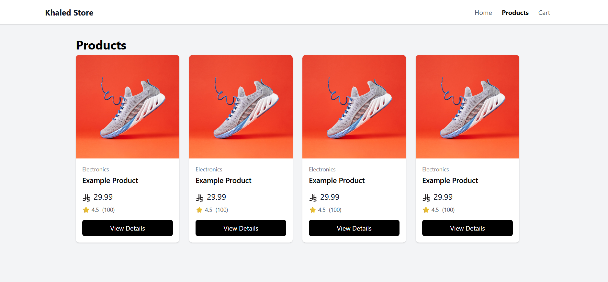

# Sprint 1 — Project Setup

## Overview

In this sprint, I created the foundation of the E-Commerce frontend application.

The goal was to establish a clean React architecture and configure the main tools that will be used throughout the project.

## Technologies

- React
- TypeScript
- Vite
- Tailwind CSS
- React Router
- Axios
- Vite Environment Variables

## Project Structure

```text
src/
├── components/
│   ├── Header.tsx
│   └── Footer.tsx
├── pages/
│   ├── HomePage.tsx
│   ├── ProductsPage.tsx
│   ├── CartPage.tsx
│   └── AboutPage.tsx
├── layouts/
│   └── MainLayout.tsx
├── hooks/
├── services/
│   └── api.ts
├── types/
├── App.tsx
├── main.tsx
└── index.css
```

## What Was Implemented

### Project Setup

- Created the React + TypeScript project using Vite.
- Configured Tailwind CSS.
- Installed React Router and Axios.
- Removed the default Vite starter content.

### Application Layout

Created a reusable `MainLayout` containing:

- Header
- Main content area
- Footer

The main content is rendered using React Router's `Outlet`.

```text
MainLayout
├── Header
├── Outlet
└── Footer
```

### Navigation

Implemented application navigation using `NavLink`.

Current routes:

```text
/
├── /products
├── /cart
└── /about
```

Navigation is handled by React Router without full-page browser reloads.

### API Configuration

Created a centralized Axios instance:

```text
React
  ↓
Services
  ↓
Axios
  ↓
Fake Store API
```

The API base URL is configured through a Vite environment variable.

```env
VITE_API_URL=https://fakestoreapi.com
```

An `.env.example` file is also provided as a configuration template.

## Concepts Practiced

- React component structure
- JSX
- Component composition
- React Router
- `BrowserRouter`
- `Routes`
- `Route`
- `NavLink`
- Nested/layout routes
- `Outlet`
- Tailwind CSS
- Axios instances
- Environment variables
- Professional frontend folder organization

## Sprint Result

The project now has a working frontend foundation with:

```text
React + TypeScript
       ↓
Tailwind CSS
       ↓
React Router
       ↓
MainLayout
       ↓
Pages + Components
       ↓
Axios
       ↓
Environment Configuration
```

No product API functionality has been implemented yet.

That will be introduced in the next sprint.

## Next Sprint

**Sprint 2 — Routes + Layout**

Focus:

- Refine application routing
- Product details route
- URL parameters
- 404 route
- Nested routes
- Route structure

# Sprint 2 — Routes + Layout

## Goal

Build the application's routing system using React Router.

The goal of this sprint is to understand how React applications manage multiple pages while keeping a shared layout.

---

## Routes

The application currently supports:

- `/` — Home
- `/products` — Products
- `/products/:id` — Product Details
- `/cart` — Shopping Cart
- `*` — 404 Not Found

---

## Architecture

```text
BrowserRouter
      │
      ▼
    Routes
      │
      ▼
 MainLayout
      │
 ├── Header
 │
 ├── Outlet
 │     │
 │     ├── HomePage
 │     ├── ProductsPage
 │     ├── ProductDetailsPage
 │     ├── CartPage
 │     └── NotFoundPage
 │
 └── Footer
```

# Sprint 3 — Product API

## Goal

Build a clean API layer for communicating with the Fake Store API.

The application now separates React UI from API communication using:

React

↓

productService

↓

api

↓

Axios

↓

Fake Store API

---

## API Endpoints

The product service supports:

- Get all products
- Get product by ID
- Get all product categories

Endpoints:

GET /products

GET /products/:id

GET /products/categories

---

## Environment Variables

The API base URL is configured using a Vite environment variable:

VITE_API_URL=https://fakestoreapi.com

The application accesses it through:

import.meta.env.VITE_API_URL

The actual `.env` file contains the local configuration, while `.env.example` documents the required variable.

Frontend environment variables are not secrets.

---

## Axios Instance

The application uses a centralized Axios instance in:

src/services/api.ts

The Axios instance uses the API URL from the environment variables.

This avoids repeating the API base URL throughout the application.

---

## Product Service

Product API operations are centralized in:

src/services/productService.ts

Available methods:

- `getProducts()`
- `getProductById(id)`
- `getCategories()`

The service returns the actual API data instead of exposing the complete Axios response.

---

## TypeScript Types

The Product model is defined in:

src/types/product.ts

It represents the structure returned by the Fake Store API.

The product contains:

- id
- title
- price
- description
- category
- image
- rating

---

## Folder Structure

```test
src/
├── components/
├── pages/
├── layouts/
├── hooks/
├── services/
│ ├── api.ts
│ └── productService.ts
├── types/
│ └── product.ts
├── App.tsx
├── main.tsx
└── index.css
```

---

## Key Learning

```text
The main concept of this sprint is API/service separation.

Instead of:

React Component
↓
Axios

the application uses:

React Component
↓
Service
↓
Axios
↓
API
```

This keeps API communication separate from UI code and provides a cleaner foundation for the next sprints.

# Sprint 4 — Product Display

## Goal

Build reusable React components for displaying products.

The product UI is organized using component composition:

```
ProductsPage
↓
ProductList
↓
ProductCard
↓
ProductImage
ProductPrice
```

---

## Product Components

Created the following reusable components:

- `ProductList`
- `ProductCard`
- `ProductImage`
- `ProductPrice`

### ProductList

Responsible for rendering the collection of products.

It uses:

```tsx
products.map(...)
```

## Screenshot



# Sprint 5 — Product Loading & API State

## Goal

Handle the different states of an asynchronous product API request.

The Products page now handles:

- Loading
- Success
- Empty
- Error
- Retry

---

## API State Flow

```text
ProductsPage
     ↓
fetchProducts()
     ↓
productService
     ↓
Fake Store API
     ↓
┌────┴────┐
↓         ↓
Success  Error
↓         ↓
Data    Retry
↓         ↓
Empty   Loading
```

# Sprint 6 — Custom Hooks

## Goal

Move product-fetching and API state logic out of `ProductsPage` and into a reusable custom hook.

The main goal is to separate:

- UI logic
- React state logic
- API communication

---

## Architecture

Before:

```
ProductsPage
    ↓
useState
useEffect
API logic
    ↓
productService
    ↓
Axios
    ↓
Fake Store API
```

After:

```
ProductsPage
    ↓
useProducts()
    ↓
productService
    ↓
Axios
    ↓
Fake Store API
```

The page is now mainly responsible for displaying the UI.

The custom hook is responsible for managing the product request state.

---

## Files

Added:

```text
src/
└── hooks/
    └── useProducts.ts
```

# Sprint 7 — Product Details

## Goal

Implement a product details page using React Router URL parameters and a reusable custom hook.

The user can navigate from a product card to:

`/products/:id`

and view the selected product's details.

---

## What Was Implemented

### Product Details Route

Added:

- `/products/:id`

React Router extracts the product ID using:

```tsx
const { id } = useParams<{ id: string }>();
```

# Sprint 8 — Cart State

## Overview

In this sprint, we introduced application-level state management for the shopping cart.

The goal was to allow different components and pages to access and modify the same cart state without passing props through multiple component levels.

---

## What was Implemented

- Cart state using React `useState`
- React Context using `createContext`
- Cart consumption using `useContext`
- Custom `useCartContext` hook
- `CartProvider`
- Add product to cart
- Remove product from cart
- Increase product quantity
- Decrease product quantity
- Clear cart
- Calculate cart total
- Calculate total item count
- Empty cart state
- Immutable state updates
- Functional state updates
- Connected `ProductCard` to the cart
- Connected `CartPage` to the cart

---

## Cart Architecture

```text
ProductCard
     |
     | addToCart(product)
     ↓
Cart Context
     |
     ↓
CartProvider
     |
     ↓
Cart State
     |
     ↓
CartPage
```

## Sprint 10 — Product Discovery (Search + Category Filtering)

**Goal:** Add search and category filtering to the products page without storing derived data in state.

**What was implemented:**

- **Search input** – filters products by title (case‑insensitive).
- **Category dropdown** – populated dynamically from the Fake Store API.
- **Derived data pattern** – `filteredProducts` is computed using `useMemo` from `products`, `searchTerm`, and `selectedCategory` (no extra state for filtered results).
- **Controlled components** – both inputs are controlled with `useState`.
- **Responsive filters** – stack on mobile, row on larger screens.
- **Empty state** – shows a friendly message when no products match the criteria.

**Files modified:**

- `src/pages/ProductsPage.tsx`

**Key learning:**

> **Don't store filtered products in state.**  
> Derive them from the source data + filter criteria. This keeps state minimal, avoids bugs from stale data, and makes the data flow predictable.

## Sprint 11 — Product Sorting

**Goal:** Add sorting options to the products page.

**What was implemented:**

- **Sort dropdown** – options for default, price (low→high, high→low), and name (A→Z).
- **Derived data pattern** – sorting is applied after filtering, all computed in a single `useMemo`.
- **Immutable sorting** – creates a copy of the array before sorting (`[...array].sort()`) to avoid mutating state.
- **Combined filters** – search, category, and sort all work together seamlessly.

**Files modified:**

- `src/pages/ProductsPage.tsx`

**Key learning:**

> **Don't store sorted products in state.**  
> Sorting, like filtering, is a **derived value**. Compute it from the source data + filter criteria + sort option. This keeps state minimal and avoids bugs.

## Sprint 13 — Application Safety (Error Boundary)

**Goal:** Add a global error boundary to catch unexpected JavaScript errors during rendering and display a fallback UI instead of crashing the whole application.

**What was implemented:**

- **ErrorBoundary class component** – uses `getDerivedStateFromError` to update state and `componentDidCatch` to log errors.
- **ErrorFallback UI** – user-friendly error page with a warning icon, error message display, and "Try Again" button (refreshes or resets the boundary).
- **Global placement** – wrapped around the Router in `App.tsx` to catch errors in any page or component.
- **Console logging** – errors are logged to the console for debugging (can be extended to send to an error reporting service).

**Files created/modified:**

- `src/components/ErrorBoundary.tsx` (new)
- `src/components/ErrorFallback.tsx` (new)
- `src/App.tsx` (updated to wrap Router with ErrorBoundary)

**Key learning:**

> **API errors vs. Rendering errors are different:**
>
> - **API errors** (network failures, 404s, 500s) are _expected_ — handle them in components with loading/error states and retry buttons.
> - **Rendering errors** (e.g., `Cannot read property of null`, `undefined is not a function`) are _unexpected_ — catch them with Error Boundaries to prevent the whole app from crashing.

> Error Boundaries are React's way of providing a try/catch for the component tree.

## Sprint 14 — Route Code Splitting (Lazy Loading)

**Goal:** Improve initial load performance by lazy-loading major pages.

**What was implemented:**

-  **React.lazy()** – dynamic imports for HomePage, ProductsPage, ProductDetailsPage, CartPage, and NotFoundPage.
-  **Suspense** – wraps routes with a loading spinner fallback.
-  **LoadingSpinner** – clean SVG spinner component.
-  **Code splitting** – Vite automatically generates separate chunks for each page.

**Files created/modified:**

- `src/components/LoadingSpinner.tsx` (new)
- `src/App.tsx` (updated with lazy imports + Suspense)

**Key learning:**

> **Lazy loading = faster initial load.** Users only download the code for the page they're visiting. This is a critical performance optimization for production apps.


